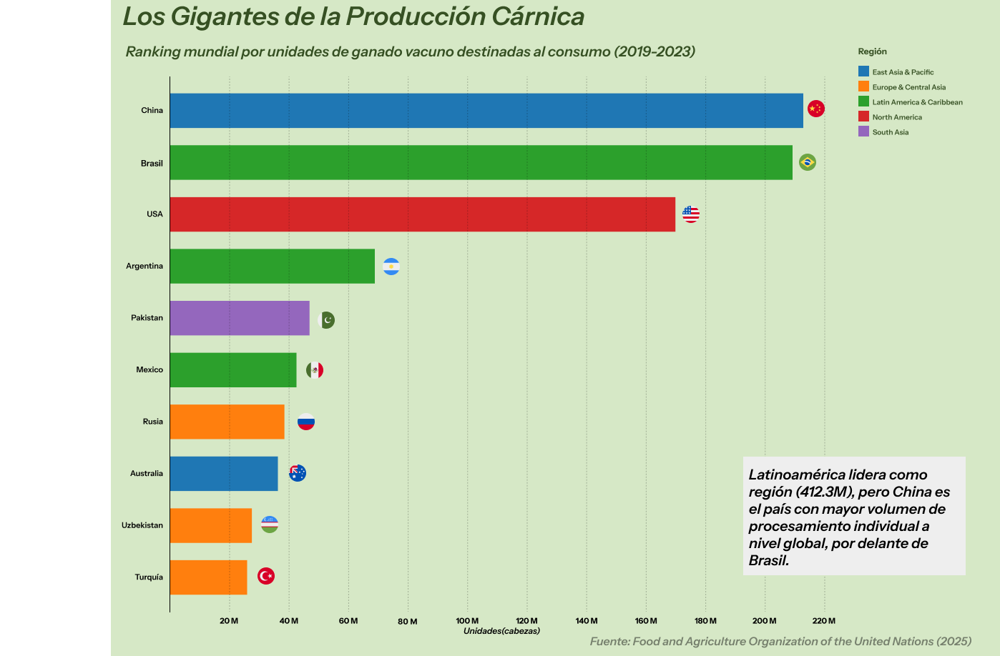

# Proyecto Final: Visualización de Datos y Storytelling

Este repositorio contiene los recursos y el resultado final del proyecto desarrollado para el **Curso de Visualización de Datos y Storytelling con Latinometrics** de Platzi.

El objetivo del proyecto fue crear una visualización de alto impacto sobre el procesamiento y consumo de ganado a nivel global, aplicando principios de diseño de información y narrativa visual.

## 🛠 Herramientas Utilizadas
* **Google Sheets:** Limpieza y estructuración de datos.
* **RawGraphs.io:** Generación del gráfico base.
* **Figma:** Diseño visual, composición y estilizado final.

## 📊 Fuentes de Datos
* **Our World in Data**
* **Food and Agriculture Organization of the United Nations (FAO)** - Datos actualizados a 2025.

# Final Project: Data Visualization & Storytelling

This repository contains the resources and final result of the project developed for the **Data Visualization and Storytelling with Latinometrics Course** at Platzi.

The goal of the project was to create a high-impact visualization regarding global livestock processing and consumption, applying information design and visual storytelling principles.

## 🛠 Tools Used
* **Google Sheets:** Data cleaning and structuring.
* **RawGraphs.io:** Base chart generation.
* **Figma:** Visual design, composition, and final styling.

## 📊 Data Sources
* **Our World in Data**
* **Food and Agriculture Organization of the United Nations (FAO)** - Data updated to 2025.

## Vista Previa del Gráfico

